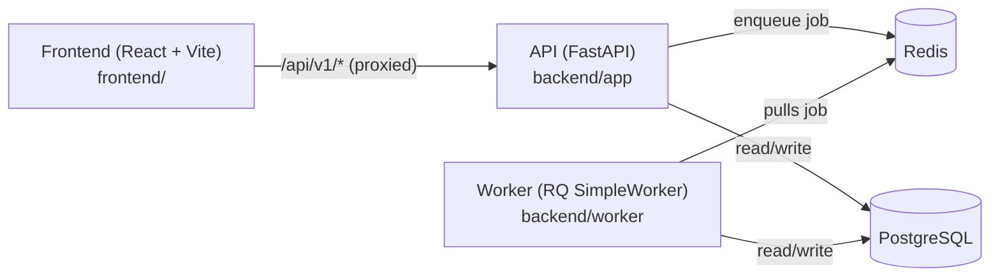

# Planning — Data Pipeline Builder

A self-service, visual ETL/data pipeline platform. Users build pipelines on a drag-and-drop
canvas, validate and preview them, then run them asynchronously via a job queue. See
[requirements.md](./requirements.md) for the full product/technical spec.

## Architecture



- **Backend API** (`backend/app`) — FastAPI, validates and persists pipeline definitions, submits
  jobs to the queue, serves job/run status.
- **Worker** (`backend/worker`) — separate process, pulls jobs off Redis and executes pipelines
  with Polars.
- **Frontend** (`frontend/`) — React + TypeScript + `@xyflow/react` canvas for building pipelines,
  plus job submission/polling UI.
- **Postgres** — stores pipelines, pipeline versions, runs, and jobs (via SQLAlchemy + Alembic
  migrations).
- **Redis** — job queue backing RQ.

## Prerequisites

- Python 3.13+ and [`uv`](https://docs.astral.sh/uv/)
- Node.js 20+ and npm
- Docker (for local Redis, and optionally local Postgres)
- A reachable PostgreSQL database (local via Docker, or remote)

## Quick start

Run each of these in its own terminal, from the repo root.

**1. Redis**
```bash
cd backend
docker-compose up redis
```

**2. Backend setup (one-time)**
```bash
cd backend
uv sync
cp .env.example .env   # then edit .env with your DATABASE_URL
uv run alembic upgrade head
```

**3. API server**
```bash
cd backend
uv run uvicorn app.main:app --port 8000 --reload
```

**4. Worker**
```bash
cd backend
uv run python -m worker.main
```

**5. Frontend**
```bash
cd frontend
npm install
npm run dev
```

Open the printed local URL (e.g. `http://localhost:5173`). The dev server proxies `/api/*` to
`http://127.0.0.1:8000` (see `frontend/vite.config.ts`), so the backend must be running first.

## Repo layout

```
backend/     FastAPI app, worker, Alembic migrations, tests — see backend/README.md
frontend/    React pipeline editor — see frontend/README.md
example_data/  Sample CSV + pipeline definition used by "Load Example" in the UI
requirements.md  Full product/technical requirements doc
QUICK_START_TESTING.md  Step-by-step backend validation checklist (Phase 3 job queue)
```

## Testing

```bash
cd backend
uv run pytest tests/ -v
```

See [QUICK_START_TESTING.md](./QUICK_START_TESTING.md) for a full manual validation checklist
(unit tests, integration tests, CLI smoke tests, curl examples) covering the async job queue.